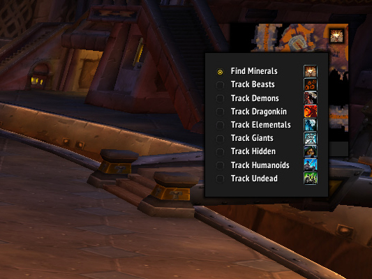

# Tukui Tracking Menu

This is an addon for World of Warctaft Classic's Tukui that adds a drop-down menu to the tracking icon, allowing you to select what to track.

## How to use

Left-click the minimap button to show the drop-down menu, right-click to cancel your current tracking buff.

## Supported tracking buffs

Professions:
- Find Herbs
- Find Minerals

Hunter:
- Track Beasts
- Track Demons
- Track Dragonkin
- Track Elementals
- Track Giants
- Track Humanoids
- Track Undead
- Track Hidden

Druid:
- Track Humanoids

Warlock:
- Sense Demons

Paladin:
- Sense Undead (Paladin)

Racials:
- Find Treasure

## Credits

Many thanks to Tukz and all other members of [Tukui.org](https://www.tukui.org) community who've put so much effort into creating the Tukui addon.
